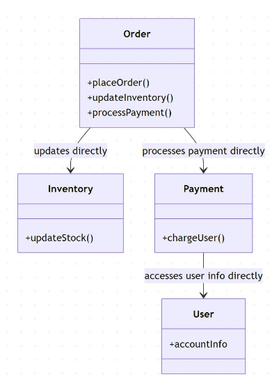
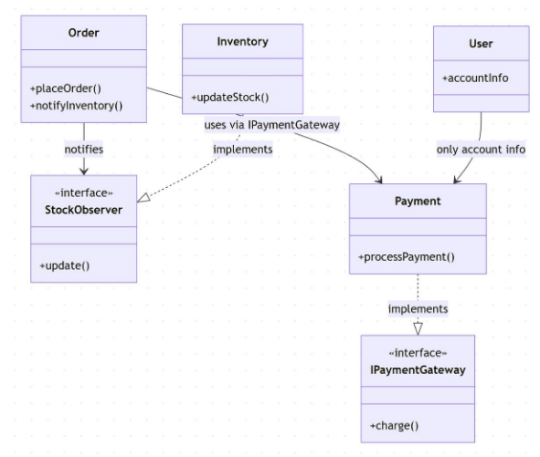

# demo

Online bookstore: Inventory, Orders, Payments, Users.

Requirements: high cohesion, low coupling, extensible.

## run1: baseline

Initial AI prompt example:

```"Generate classes for an online bookstore system handling inventory, orders, payments, and users.```




### flaws:

* Order updates Inventory directly → violates SRP.
* Payment tightly coupled to User → hard to test.
* No interfaces for external services.
* Identify violations of SRP, DIP, and OCP.
* Detect tight coupling and lack of abstraction.
* Recognize scalability risks: adding new payment
types or notifications will require major changes

## run2

```
"Design an online bookstore system with separate modules for Inventory, Orders, Payments, and
Users. Use interfaces for external services, follow SRP and DIP, and apply patterns to decouple
modules."```




* Order triggers inventory updates via Observer pattern.
* Payment implements an IPaymentGateway interface → decoupled.
* User only manages user data; no direct payment or order processing.
* Each module independent, easier to test and extend.