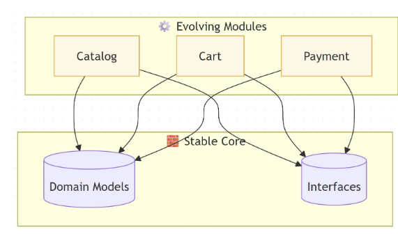

#  Modularity

## Principles 
* Horizontal vs Vertical: Scale out before scaling up.
* Statelessness enables elasticity — state kills scalability.
* Bottleneck Awareness: Identify hotspots early with metrics.
* Graceful Degradation: A scalable system bends, not breaks.
* Predictable Growth: Design for the curve, not the moment

## Designing for Longevity

Encapsulate volatility — isolate what changes frequently

