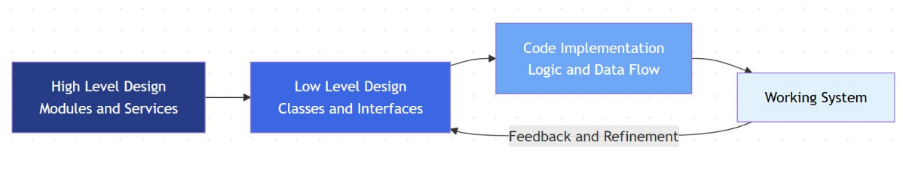
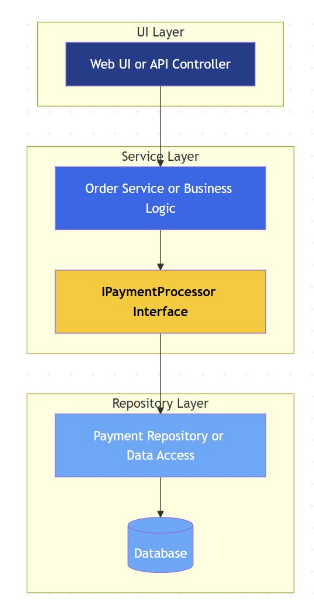
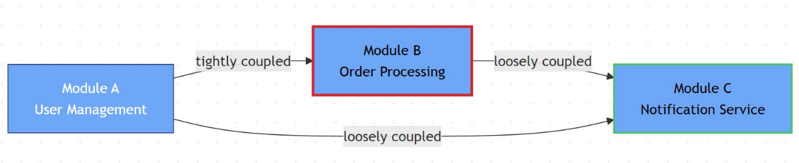
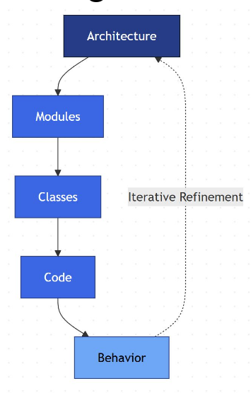

# low level design

High-level design shapes architecture — but low-level design shapes quality

LLD translates high-level architecture into class-level, method-level, and
interaction-level design.

## core blocks

* Components: Logical groupings that deliver a cohesive function.
* Modules: Collections of related classes forming functional units.
* Interfaces: Define contracts; separate behavior from implementation.
* Abstraction Layers: Manage complexity and isolate change.
* Responsibilities: Each unit should have one clear reason to change (SRP).

## Relationships

* Dependency: One module uses another — minimize directionality.
* Association & Composition: Define ownership and lifecycle strength.
* Coupling: Keep modules loosely connected via abstractions.
* Cohesion: Group related logic tightly within the same module.

