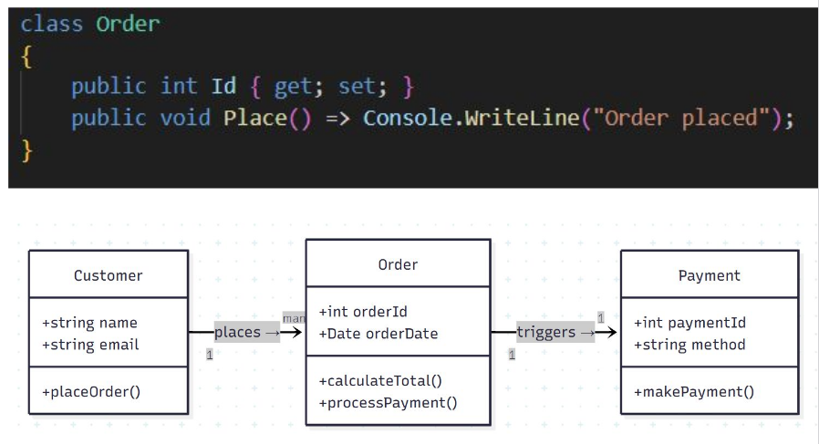
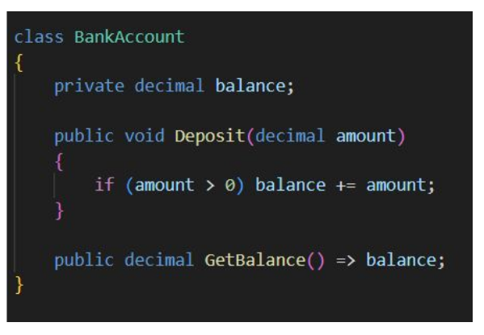
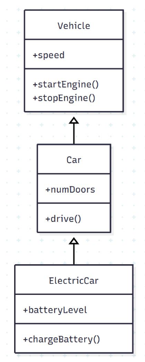
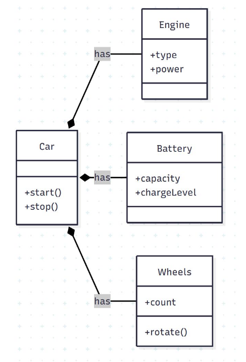
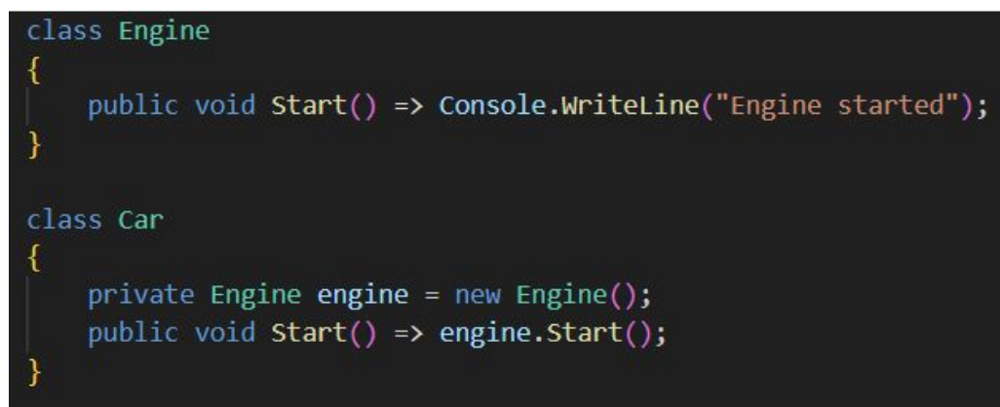
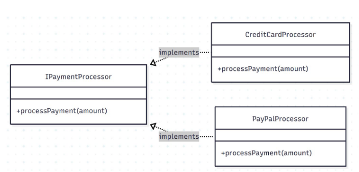
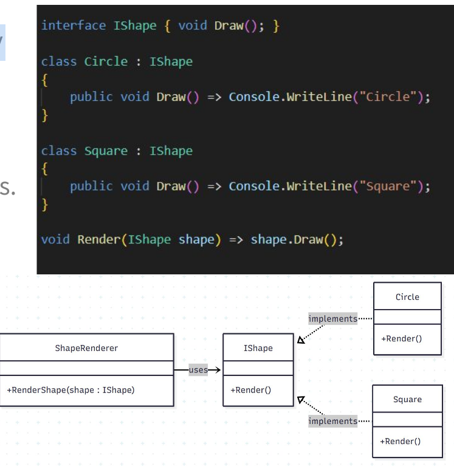
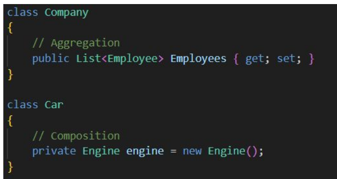

# foundational principles

* Encapsulation protects, abstraction hides, composition empowers.
* Inheritance and polymorphism enable extensibility

## Objects
* object has data (state) and behavior (methods).
* classes as contracts for collaboration.

## Encapsulation
* Protect What Matters - bundling data + logic and hiding internals

## Inheritance
* Reuse Through Extension
* Defines “is-a” relationship — a subclass extends base behavior

* Risk: tight coupling and fragile hierarchies.
* Keep inheritance shallow and meaningful

## Composition 
* Reuse Through Collaboration - use delegation!
* “Has-a” relationship — objects work together instead of inheriting.

* Encourages loose coupling and flexibility.
* Easier to modify or replace parts.

## Abstraction 
* Simplify the Complex
* Hides unnecessary detail; focuses on what, not how.
* Supports the Open/Closed Principle — extend without modifying.

## Polymorphism
* One Interface, Many Behaviors
* Allows different objects to respond differently to the same call.
* Decouples client code from concrete implementations.

## Relationships
* Association: one class uses another (temporary link).
* Aggregation: “has-a” but independent lifecycles.
* Composition: “owns” the part — lifecycle bound together.

