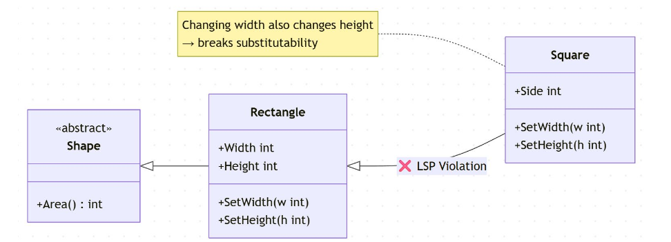
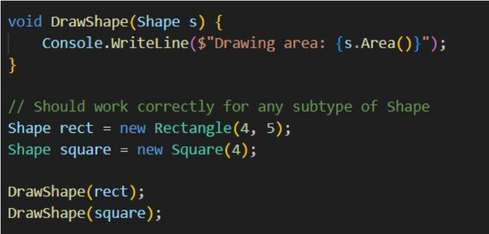
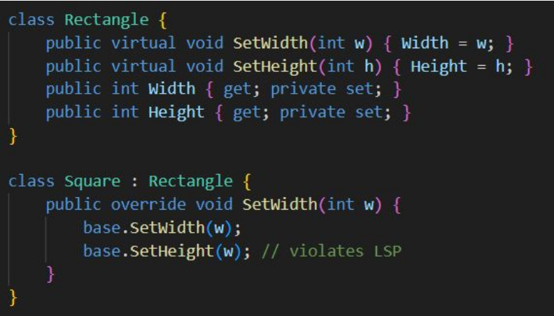
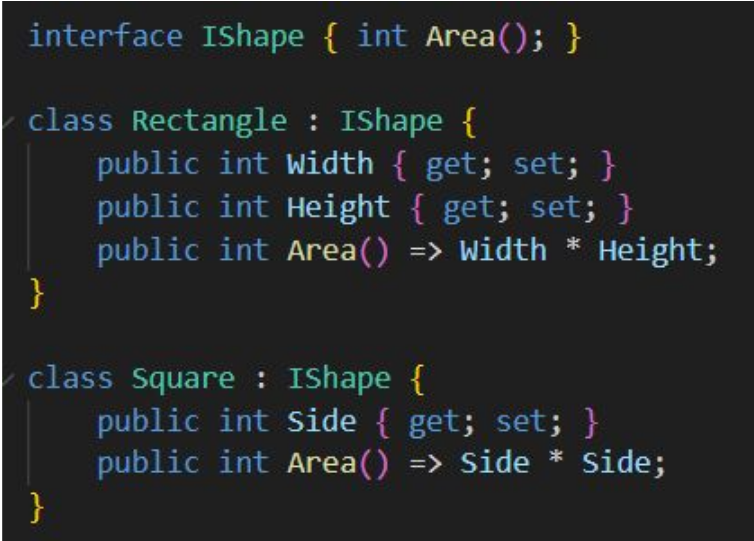
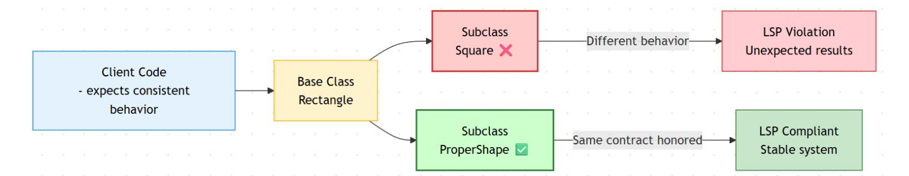

# LSP

Liskov Substitution Principle

* Subtypes must be substitutable for their base types without altering program correctness
* behavior consistency across inheritance hierarchies

## Substitutability
* Any subclass should be usable anywhere the base class is expected

## example fix

composition over inheritance

