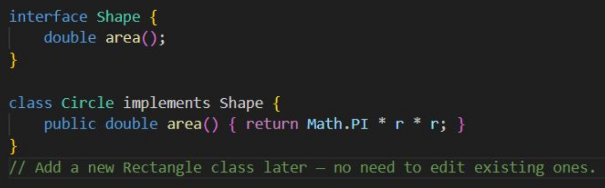
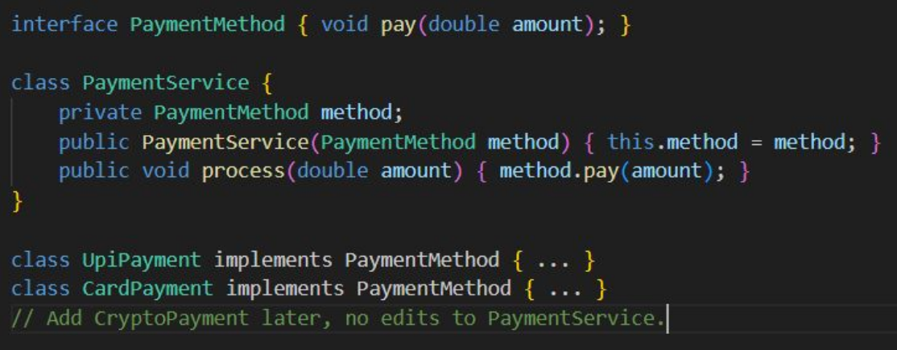
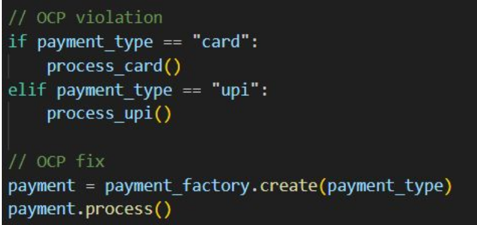
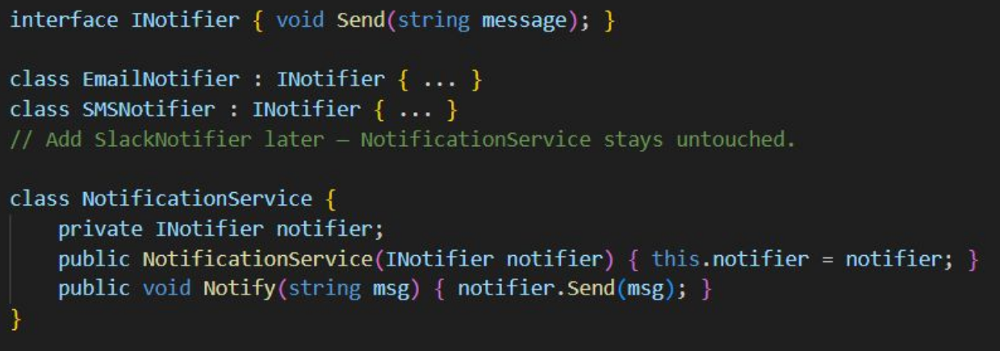
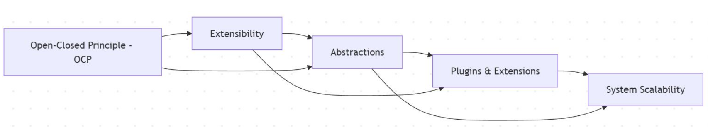

# OCP

Open-Closed Principle

* You add new behavior without changing tested code
* Implemented via abstraction, inheritance, and interfaces.
* Foundation of maintainable, evolving systems.

## Extending Without Modifying

* create new subclasses or implementations
 

* Replace if/else with polymorphism.

## exampls

