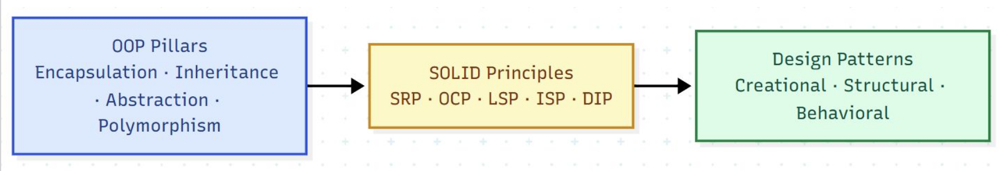
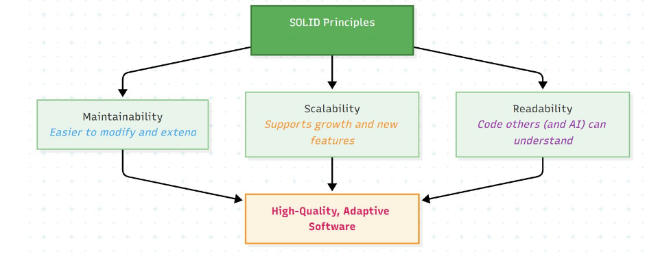
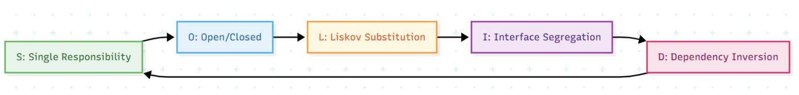
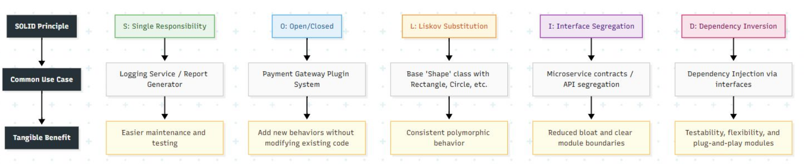

# SOLID

## about
● S – Single Responsibility Principle: One reason to change.
● O – Open/Closed Principle: Open for extension, closed for modification.
● L – Liskov Substitution Principle: Subclasses should behave like their parents.
● I – Interface Segregation Principle: No class should depend on methods it doesnʼt use.
● D – Dependency Inversion Principle: Depend on abstractions, not concretions.

## Work Together

● SRP simplifies classes; OCP lets them evolve safely.
● LSP ensures polymorphism behaves predictably.
● ISP keeps interfaces clean and focused.
● DIP aligns high-level policies with abstract contracts

