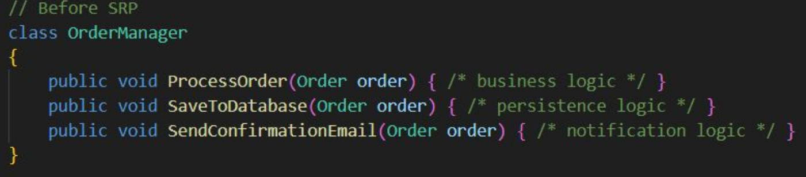
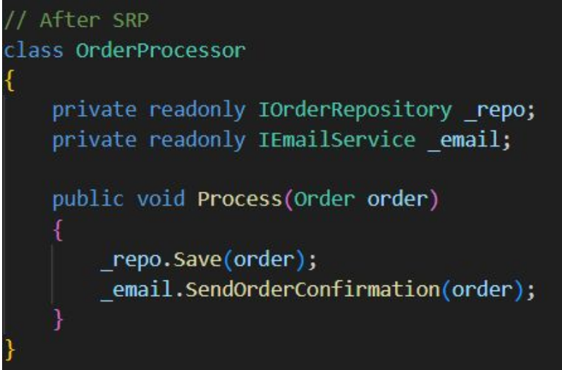

# SRP

Single Responsibility Principle

* Every class should have one and only one reason to change.
* When a class tries to “do it all,” it becomes fragile and hard to maintain.
* Not about small classes — about focused responsibilities.

