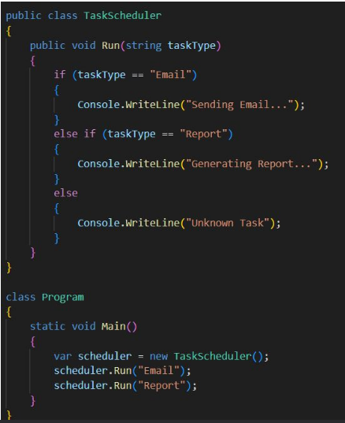
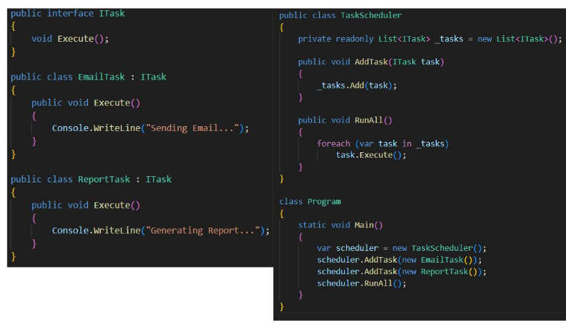

# "solid" Demo

## run1 - base line

“Write a simple C# task scheduler that can execute
tasks like sending emails or generating reports.”



### Violations:
* SRP Violation: TaskScheduler does everything — scheduling and task logic.
* OCP Violation: Adding new tasks means editing Run() and recompiling.
* DIP Violation: High-level module depends on concrete strings and logic.
* Hard to Test: No abstractions or interfaces to mock.
* Unscalable: Imagine 50 task types — this if chain explodes

### why?
* AI followed functionality, not architecture.
* It didnʼt separate what from how.
* It lacks awareness of design trade-offs.
* But AI is not wrong — it just needs better intent.

## run2: solid prompt

* dont tell him how to code - tell him how to design!

```
Refactor the Task Scheduler so that:
■ Each task implements an ITask interface with an Execute() method.
■ The scheduler depends only on ITask abstractions (DIP).
■ New tasks can be added without modifying scheduler code (OCP).
■ Each class has one reason to change (SRP)
```




```Functional correctness is step one — design correctness is mastery.```