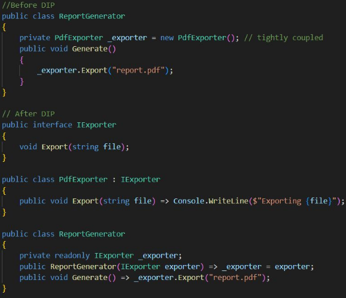
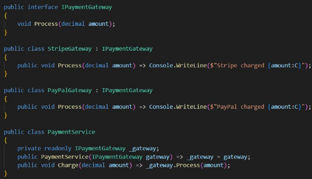
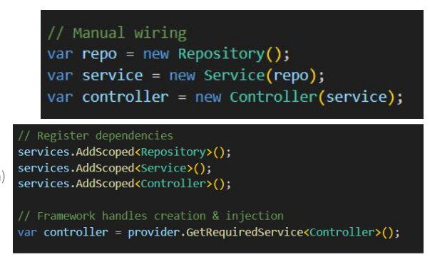

# DIP

Dependency Inversion Principle 

* High-level modules should not depend on low-level modules -  both should depend on abstractions.
* Builds flexibility into architecture —
layers evolve independently.

* High-level modules: contain business logic (OrderService, PaymentService).
* Low-level modules: handle details (EmailNotifier, FileLogger, SqlRepository)
* With DIP → both rely on interfaces or abstractions.

* Abstractions define what, implementations define how.
* Use interfaces or abstract classes to formalize behavior.

## IOC - Inversion of Control 
* Move object creation and lifecycle management outside your code.

## DI - Dependency Injection
* Concrete way to implement IoC — inject dependencies at runtime

abstractions in code, automation in runtime

