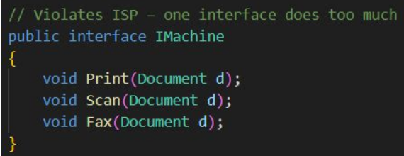
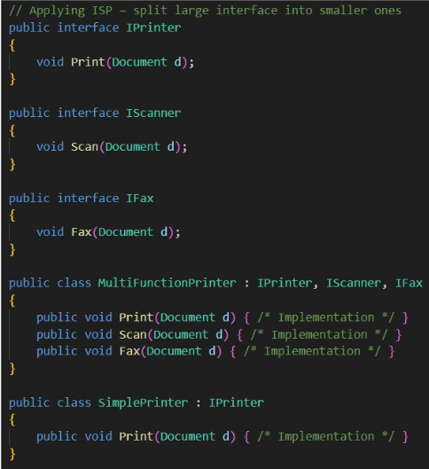
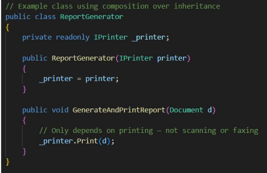

# isp

Interface Segregation Principle

* Clients should not be forced to depend on methods they donʼt use.
* client-specific interfaces over “one-size-fits-all.”
* Reduces unnecessary coupling and code breakage

* use Focused Interfaces

* Reducing Unused Dependencies - Use composition over inheritance to inject only whatʼs needed.

