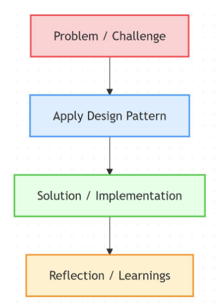
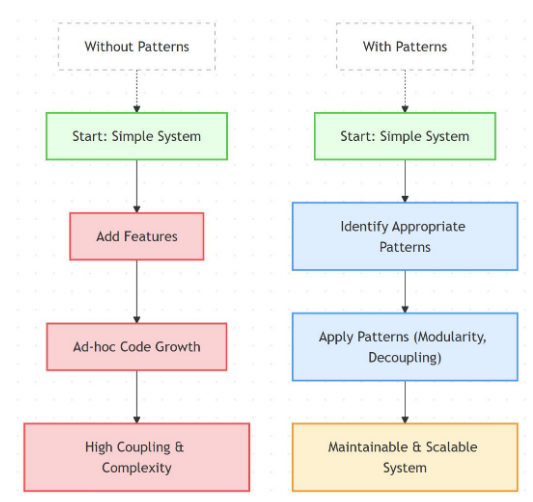
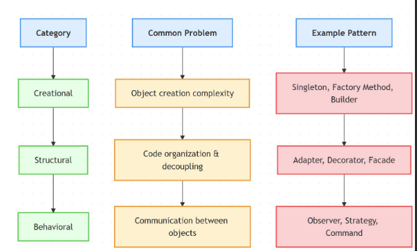
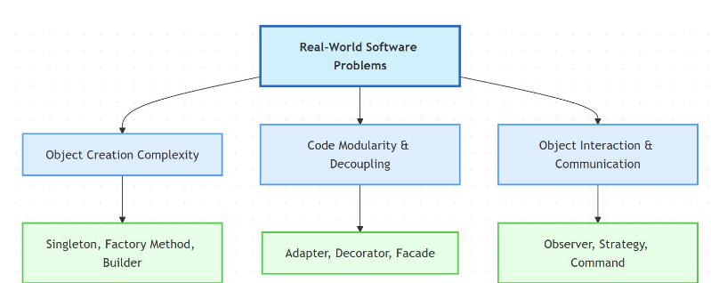

# Design Patterns

Reusable solutions to common software design problems

patterns help manage growth without chaos.

## Categories

* Creational: Control object creation; manage complexity and dependencies.
    *  Simplifies object instantiation, enforces consistency, hides construction complexity
* Structural: Organize modules; decouple code; simplify integration.
    * Promotes modularity, improves maintainability, allows flexible code composition.
* Behavioral: Define communication patterns; manage object interactions.
    * Streamlines communication, ensures predictable object interactions, reduces coupling.

