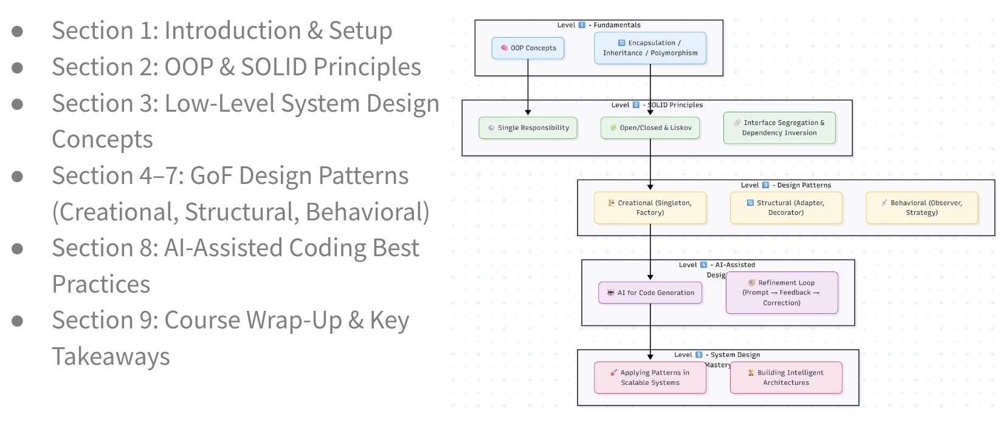
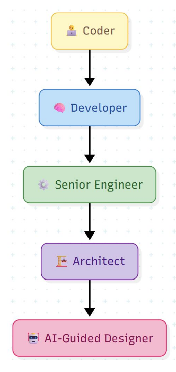

# Low-Level System Design Patterns with AI

* udemy::Mastering Low-Level System Design & Design Patterns with AI

## 01 principles
* [OOP](./01_princ/readme.md)
* [SOLID](./01_princ/solid.md)
* [SRP](./01_princ/srp.md)
* [OCP](./01_princ/ocp.md)
* [LSP](./01_princ/lsp.md)
* [ISP](./01_princ/isp.md)
* [DIP](./01_princ/dip.md)

## 02